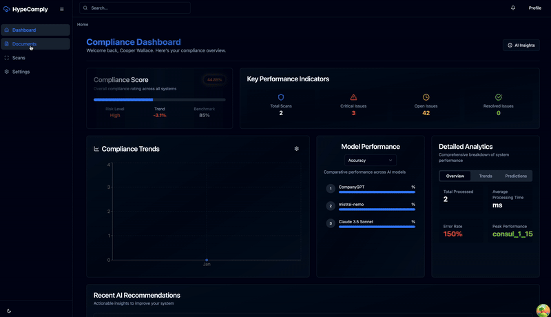

# AI-Powered Security Compliance Platform

An agentic AI platform for automated security scanning, compliance analysis, and continuous monitoring.




## Features

- **Automated Security Scanning**
  - Container image vulnerability scanning
  - Infrastructure security checks
  - Git repository analysis
  - Real-time streaming analysis

- **AI-Powered Analysis**
  - GPT-4 integration for intelligent analysis
  - Function calling for dynamic compliance checks
  - Automated remediation recommendations
  - Compliance impact assessment

- **Compliance Management**
  - Document management system
  - Policy-scan correlation
  - Standards mapping (ISO27001, SOC2, etc.)
  - Compliance trend tracking

## Tech Stack

- **Backend**
  - FastAPI
  - SQLAlchemy
  - OpenAI GPT-4
  - Alembic migrations
  - pytest

- **Frontend**
  - React + TypeScript
  - TailwindCSS
  - shadcn/ui components
  - React Query

## Getting Started

1. Clone the repository
```bash
git clone https://github.com/coopdloop/compliance-ragops
```

2. Set up environment variables
```bash
# Backend (.env)
AUTH0_DOMAIN=your-domain
AUTH0_AUDIENCE=your-audience
CORS_ORIGINS=http://localhost:3000
... etc
```

3. Install dependencies
```bash
# Backend
cd backend
pip install -r requirements.txt

# Frontend
cd frontend
npm install
```

4. Run migrations
```bash
cd backend
alembic upgrade head
```

5. Start development servers
```bash
# Backend
uvicorn main:app --reload

# Frontend
npm run dev
```

## Docker Deployment

```bash
docker-compose -f docker-compose.dev.yml up --build
```

## API Documentation

Access the OpenAPI documentation at `http://localhost:8000/docs`

## Architecture

- `/backend`: FastAPI application
  - `/app`: Main application code
    - `/api`: API endpoints and routers
    - `/models`: Database models
    - `/schemas`: Pydantic schemas
    - `/services`: Business logic and AI services

- `/frontend`: React application
  - `/src/components`: React components
  - `/src/pages`: Page components
  - `/src/types`: TypeScript type definitions
  - `/src/lib`: Utilities and configurations

## Contributing

1. Fork the repository
2. Create a feature branch
3. Submit a pull request

## License

MIT
